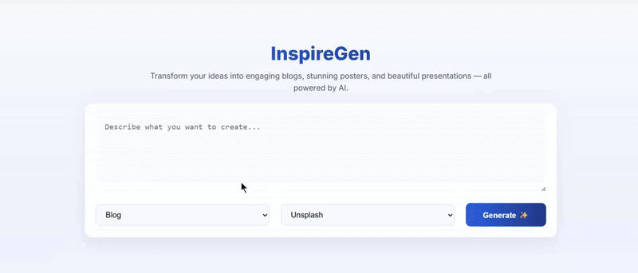

# **🚀 InspireGen — AI-Powered Content Generator**

### **Create compelling, high-quality content using the Llama-3.1-8B-Instruct model (Hugging Face) — Built with React + Vite**


**InspireGen** is a modern, fast, and fully modular **AI content generation application** built with **React**, **Vite**, and a clean, scalable architecture.
It allows users to generate **blogs, social posts, marketing copy, descriptions, and creative content** — all powered by a connected AI model.

---

## 🌐 **Live Demo**

👉 **[inspiregen](https://inspiregen.netlify.app/)**

---

## 🎥 **Preview**



---

## 🎯 **What is InspireGen?**

**InspireGen** is an **AI-driven content automation tool** designed for developers, creators, and marketers who want to generate high-quality text with minimal effort.
Users simply enter a prompt — InspireGen handles the rest with intelligent model-generated output.

It is built with:

✔ **Fast Vite bundler** <br>
✔ **Scalable React architecture** <br>
✔ **AI model integration (Hugging Face / Llama-3.1-8B)** <br>
✔ **Reusable components & hooks** <br>
✔ **Environment-based secure API keys** <br>

---

## ❓ **Why InspireGen?**

Many content-generation tools suffer from:

❌ Complex architecture <br>
❌ High cost <br>
❌ Poorly organized codebases  <br>

**InspireGen** improves the developer and user experience by offering:

✅ **Lightweight, fast, and responsive UI**  <br>
✅ **Clean modular folder structure**  <br>
✅ **Easy .env setup for API keys**  <br>
✅ **Flexible service layer for model switching**  <br>
✅ **Optimized development workflow using Vite**  <br>

Perfect for:

* Developers learning AI model integration
* Building AI-powered tools
* Enhancing your React portfolio
* Businesses automating content creation

---

## ✨ **Features**

* ⚡ **Ultra-fast UI** powered by Vite
* 🤖 **AI text generation** (Hugging Face + Llama-3.1-8B ready)
* 🧩 **Modular architecture** (components, hooks, services)
* 📦 **Clean file organization for scalability**
* 🎨 **Modern, reusable UI components**
* 🔐 **Secure environment variables**
* 📱 **Fully responsive design**
* 🔄 **Easily extendable to multiple AI providers**

---

## 📁 **Project Structure**

```
inspiregen-ai-content-generator/
│
├── public/
│
├── src/
│    ├── api/                       # API service calls
│    ├── assets/                    # Images, icons
│    ├── common/                    # Reusable UI components
│    ├── components/                # Feature-specific components
│    ├── context/                   # App-level context providers
│    ├── hooks/                     # Custom React hooks
│    ├── pages/                     # App pages (Home, Generator, etc.)
│    ├── services/                  # AI services & utilities
│    ├── style/                     # Global styles
│    ├── utils/                     # Helper/utility functions
│
│    ├── App.jsx                    # Root app component
│    ├── main.jsx                   # App entry point
│    ├── App.css
│    ├── index.css
│
├── .env.example                    # Example environment variables
├── .gitignore
├── .hintrc
├── eslint.config.js
├── index.html
├── package.json
├── vite.config.js
└── README.md
```

---

## 🔑 **Environment Variables (IMPORTANT)**

Create a `.env` file in the root of the project and add:

```
VITE_HF_API_KEY=your_huggingface_key
VITE_OPENAI_API_KEY=your_openai_key   # optional
```

> ⚠️ Do **not** expose real keys in GitHub.

---

## ⚙️ **Installation & Setup**

### 1️⃣ Clone the repository

```bash
git clone https://github.com/sumanthsaivenkat1113/inspiregen-ai-content-generator.git
cd inspiregen-ai-content-generator
```

### 2️⃣ Install dependencies

```bash
npm install
```

### 3️⃣ Add API keys to `.env`

```
VITE_HF_API_KEY=HF_API_KEY
VITE_PEXELS_API_KEY=PEXELS_API_KEY
VITE_PIXABAY_API_KEY=PIXABAY_API_KEY
VITE_UNSPLASH_API_KEY=UNSPLASH_API_KEY
VITE_GOOGLE_AUTH=GOOGLE_AUTH
```

### 4️⃣ Start the development server

```bash
npm run dev
```

Now visit:

```
http://localhost:5173
```

---


## 🧠 Technology Stack

| Category | Technologies | Focus and Rationale |
| :--- | :--- | :--- |
| **Core Frontend** | **React.js** (Hooks) | High-performance Single-Page Application (SPA) development. |
| **Bundling & Dev** | **Vite** (Bundler & Dev Server) | Ultra-fast Hot Module Replacement (HMR) and optimized production builds. |
| **Styling & UI** | **Modular CSS** (Flexbox/Grid), **CSS Variables** | Component-level styling with a foundation for a Design System via Tokens. |
| **AI Abstraction** | **Hugging Face Inference API** (Llama-3.1-8B) | Primary AI model integration, decoupled via the **Service Layer**. |
| **Dev Standards** | **ESLint**, **HTMLHint** | Ensuring code quality, consistency, and adherence to industry best practices. |
| **Architecture** | **Service Layer Abstraction**, **Component Modularity** | Enforcing **SoC** for provider agnosticism and enhanced testability. |

---


## 🛠️ How InspireGen Works

InspireGen is built with a clean, scalable, and production-ready architecture that separates the UI, business logic, and AI interaction layers. Each generator (Blog, Presentation, Poster, Image Search) follows the same workflow but uses different output templates to produce highly structured results.

---

### 🔹 Core Architecture Flow (All Features)

1. **User submits a prompt** through the User Input Terminal.
2. The prompt is transformed by the **Prompt Engineering Layer**.
3. A structured request is executed through the **API Layer** (`/src/api/huggingface.js`).
4. Hugging Face’s **LLaMA / HF Inference Router API** returns a validated JSON response.
5. React components render the final output using corresponding templates.

---

### 🔧 High-Level Pipeline

User Input Terminal  
        ↓  
Prompt Engineering Layer  
        ↓  
API Layer (Hugging Face API Wrapper)  
        ↓  
Validated JSON Response  
        ↓  
Template Rendering (React Components)  
        ↓  
Final Output (Rendered UI)

---

## 📝 Blog Generation Workflow

User Input Terminal  
        ↓  
Prompt Engineering Layer  
        ↓  
LLaMA LLM (Hugging Face Router API)  
        ↓  
Validated Blog JSON Response  
        ↓  
Blog Template Rendering (React Components)  
        ↓  
Final Blog Output (Fully Rendered UI)

---

## 📊 Presentation Generation Workflow

User Input Terminal  
        ↓  
Prompt Engineering Layer  
        ↓  
LLaMA LLM (Hugging Face Router API)  
        ↓  
Validated Presentation JSON Response  
        ↓  
Presentation Template Rendering (React Components)  
        ↓  
Final Presentation Output (Fully Rendered UI)

---

## 🎨 Poster Generation Workflow

User Input Terminal  
        ↓  
Prompt Engineering Layer  
        ↓  
Validated Poster JSON  
        ↓  
Poster Component Rendering (React Components)  
        ↓  
Final Poster Output (Fully Rendered UI)

---

## 🖼️ Image Generation Workflow

A clean 4-step pipeline that converts user intent → keywords → images → UI-ready JSON.

User Input  
        ↓  
Keyword Extraction  
        ↓  
Image API Fetch (Pexels, Pixabay, Unsplash)  
        ↓  
Image JSON → UI Rendering

---

### ✅ Why This Architecture Works

- Strong **separation of concerns**
- Highly **scalable** and easy to extend
- Predictable and consistent **validated JSON outputs**
- Maintains a **production-level folder structure**
- Ensures React components remain **clean, modular, and maintainable**


## 📈 **Future Enhancements**

Planned improvements:

* 🌙 Dark / Light Mode
* 📄 Export content (PDF / Markdown)
* 💾 Local history of generated content
* 🖼️ AI image generation
* 🧠 Support for more models (Claude, Gemini, etc.)
* 🧩 Prompt templates with drag-and-drop
---

## 🤝 **Contributing**

Pull requests are welcome!
To contribute:

1. Fork the repository
2. Create a feature branch
3. Commit your changes
4. Submit a pull request

---

## 📄 **License**

This project is licensed under the **MIT License**.
You are free to use, modify, and distribute it.

---

## 👨‍💻 **Author**

**Sumanth Gunji**
AI-Driven Full-Stack Developer
Passionate about building clean, scalable, intelligent applications.


